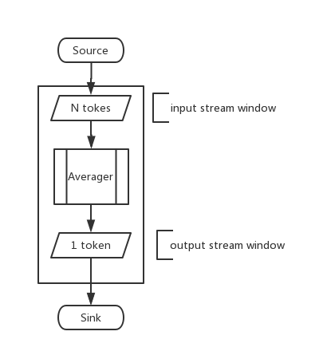

# [](#header-1)简介

COStream编程语言是一种面向并行体系结构的高性能流编程语言，由[华中科技大学数字媒体处理与检索实验室](media.hust.edu.cn)多核计算与流编译组设计与开发。语言的名称由3个关键字：composite、operator和stream组合而来。COStream程序采用数据流图的方式来描述应用的处理过程，图中节点表示计算，边表示数据的流动。COStream语言具有广泛的应用领域，当前主要用于面向大数据量处理应用，如媒体处理、信号处理、搜索应用、数据文件处理等。

# [](#header-1)COStream语言主要特性
>流程序，即有序处理数据序列的程序，最常出现在声音、视频、数字信号处理的上下文中。流程序非常适合多核系统结构。对流应用的兴趣催生了一系列的作用于流域的程序语言，如COStream, Cg, StreamIt等。

COStream编程语言是一种面向并行体系结构的高性能流编程语言，采用同步数据流图的计算模式，即程序实现了一些独立的结点(为独立计算单元，COStream中称为actor)，这些结点通过输入和输出通道进行数据传递(即actor的输出边和输出边)，这些节点一起组成了代表整体运算的流图。

#### [](#header-4)COStream语言的主要目的是:
* 在多核架构下揭露并利用流程序固有的并行性
* 自动实现特定域中流应用专家进行的优化
* 提高程序员在流域中的工作效率

#### [](#header-4)COStream如何实现程序的并行:
1. 任务划分  
给数据流图中的各结点分配处理器核（核的总个数由后台程序员确定），一个结点对应一个核，一个核可对应多结点，使各核的计算量大致相同，总通信开销尽量小。
1. 阶段赋值  
给数据流图中各结点分配阶段号（总的阶段号由编译器决定），使每一阶段的总工作量大致相同，前一阶段的结点所需数据不依赖后一阶段中结点的输出。
1. 软件流水  
采用软件流水技术，实现并行。其中，软件流水中第n阶段执行阶段号为n的结点。


# [](#header-1)一个简单的.cos程序
下面这段代码给出了一个用COStream编写的一个程序实例。
```c++
composite Main(){
  int N = 10;
  stream<int x>S,P;
  S = Source(){
    int x;
     init {x = 0;}
     work {
       S[0].x = x;
       x++;
     }
     window{
       S tumbling(1);
     }
  };
  P = MyOp(S)(N);   
  Sink(P){
    work{
      int r;
      r = P[0].x;
      println(r);
    }
    window{
      P tumbling(1);
    }
  };
}
composite MyOp(output Out,input In){
  param
    int pn;
  Out = Averager(In){
    work{
      int sum = 0;
      int i;
      for(i=0;i<pn;i++)
        sum += In[i].x;
      Out[0].x = sum/pn;
    }
    window{
      In sliding(pn,1);
      Out tumbling(1);
    }
  };
}
```
程序的功能为求移动平均值，该程序由三个operator组成即Source，Averager和Sink。其功能如下：Source作为数据源产生由“0”开始的自然数序列输出给Averager；Averager将得到的前N个自然数求平均值并消耗掉最早得到的一个数据，把计算得到的平均值输出给Sink；Sink将得到的平均值打印到屏幕。下面给出了该程序对应的SDF图：


# [](#header-1)COStream适用的程序
#### [](#header-2) 大的数据流  
适合COStream应用的最根本特征体现在其在一个大数据序列(甚至是无穷的)，即数据流上进行操作，数据流中的每一个数据项在有限的时间内被处理，然后被丢弃。
#### [](#header-2)	独立的数据流结点  
从概念上说，一个流的计算体现在该程序中数据流的转换。我们定义数据流的基本计算单元为actor：在每次执行阶段中，从输入流中读一个或多个数据项，对其进行计算，然后将一个或多个计算结果写入到输出流中。Actor通常都是独立和自足的，即没有包含对全局变量和其他actor的引用。一个流程序就是由一系列的actor组成的数据流图，其中一些actor的输出将是另外一些actor的输入。
#### [](#header-4)	一个稳定的计算模式  
在程序稳态执行的过程中，数据流图的结构通常是不变的。即，一系列确定的actor将按照一个有序的顺序反复执行，给定一个输入数据流，将产生一个输出数据流。
#### [](#header-4)	滑动窗口的计算  
数据流中的每一个值通常都会被同一个actor在连续的执行中所检测，也被称为滑动窗口。滑动窗口的例子包括生物序列分析、自然语言的处理、图像的处理（锐化、模糊化等）、网络数据包的检测等。
#### [](#header-4)	偶尔的流外通信  
除了大容量的数据流将从一个actor流向另一个actor，actor也将通信一些少量的控制信息在一些罕见的不规则的基础上。例如：改变手机的音量，在屏幕中打印错误信息，或者改变自适应FIR actor中的系数。 这些信息通常和数据流中的数据相同步，例如调频电台在数据流中的某个特定点的传输时改变其频率。
#### [](#header-4)	高性能的期望  
通常一些数据流程序需要满足实时性的限制，因此效率（延迟和吞吐量反面）是主要的考虑因素。另外有一些嵌入式的流程序将用于手机环境中，因此电量消耗，存储限制，代码大小限制等也很重要。

# [](#header-1)COStream不适用的程序
#### [](#header-4)流结构的动态修改  
COStream采用静态数据流图，不能在运行时候动态改变流图。一些流程序即使各个层次的actor执行很长一段时间后，偶尔也需要动态的修改流图。例如，如果一个无线网络的接口在其输入通道中经历了高噪声，这将使其需要产生一些actor去消除这些信号。或当网络协议从802.11变成了Bluetooth，它也可能重新初始化其子图。
#### [](#header-4)actor的输入输出速率动态改变  
COStream各actor的输入输出速率在运行时恒定。一些应用程序需要对输入数据流进行分析，舍弃不符合需求的数据，即动态改变actor的输出速率。例如图像surf特征提取，以图像像素点为输入数据流，首先判断输入流中的数据项是否为特征点，若是特征点才进行下一步处理。

# [](#header-1)COStream应用举例
### [](#header-3)实际应用（30）

|:-------------|:------------------ |
| MPEG2的编解码 		 | – MPEG2 encoder / decoder |
| JPEG的编解码		 |	– JPEG decoder / transcoder |
| 通道声码器		    |	– Channel Vocoder |
| GSM解码器			| – GSM Decoder |
| 地面移动目标指示器	| – Ground Moving Target Indicator |
| 介质中的脉冲雷达	|	– Medium Pulse Compression Radar |
| 雷达阵列前端		|	– Radar Front Array End |
| 合成孔径雷达		|	– Synthetic Aperture Radar |
| 目标探测器		|		– Target Detector |
| 特征辅助跟踪		|	– Feature Aided Tracking |
| 光线跟踪		|		– RayTracer |
| DES加密			|	– DES encryption|
| Serpent加密算法	|	– Serpent encryption|
| 马赛克			|		– Mosaic|
| 声音合成机			|	– Vocoder|
| MP3子程序				|– MP3 subset|
| 3GPP物理层			|- 3GPP physical layer|
| 频率调频电台		|	– Freq-hopping radio|
|  正交频分复用		|	– Orthogonal Frequency Division Multiplexer|
|  高清电视			|	– HDTV|
|  H264子集				|– H264 subset|
| 过滤器集合				|– Filterbank|
| 802.11a 传输器			|– 802.11a transmitte|
| FM收音机			|	– FM Radio|
| DTOA转换器		|	– DToA Converte|

### [](#header-3)库和内核( 23个) 	Libraries / kernels (23):

|:-------------|:------------------ |
| 自相关作用		|		– Autocorrelation |
| 矩阵乘法		|		– Matrix Multiplication |
| Cholesky分解	|		– Cholesky |
| 循环冗余检验码	|	– CRC |
| Oversampler	|			– Oversampler |
| 转换率			|		– Rate Convert |
| 离散余弦变换	|		– DCT (1D / 2D, float / int) |
| 快速傅里叶变换	|	– FFT (4 granularities) |
| 时域均衡			|	– Time Delay Equalization |
| Trellis量化		|		– Trellis |
| Lattice			|		–Lattice |
| Vector相加			|	– VectAdd |

### [](#header-3)图像管道( 4个)	Graphics pipelines (4):

|:-------------|:------------------ |
|	管道相关			 |	–Reference pipeline |
|	Phong着色 |				– Phong shading |
|	体积阴影			 |	– Shadow volumes |
|	粒子系统			 |	– Particle system |

### [](#header-3)排序算法( 8个)	Sorting routines (8)

|:-------------|:------------------ |
| 	双调排序(3个版本)	  |	– Bitonic sort (3 versions) | 
| 	插入排序			|	– Insertion sort |
| 	冒泡排序			|	– Bubble Sort |
| 	比较计数			|	– Comparison counting |
| 	合并排序			|	– Merge sort |
| 	计数排序			|	– Radix sort |

* * *

关于COStream语言的定义、编程规范和编译器行为（包括静态和动态）的详细说明等，详见[《COStream流语言编程指南》](book/index.html)。
